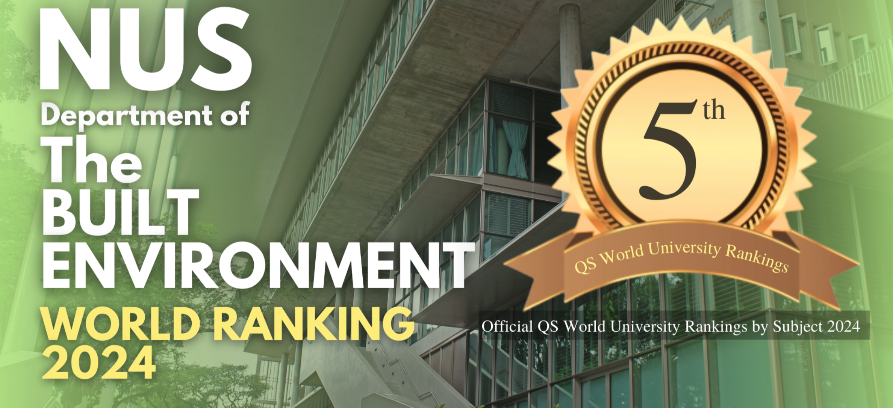

## **Table of contents**
---
1. [NUS and Our Lab](#about)
2. [Ph.D. Students](#phd)
    1. [PhD Requirements](#phd_requirements)
    2. [How to Apply](#how_to_apply)
3. [Postdoctoral Researchers](#postdoc)
4. [Visiting Students/Scholars](#visiting)

## **NUS and Our Lab** 
---
The National University of Singapore (NUS) is Singapore's flagship university, which offers a global approach to education, research and entrepreneurship. NUS holds an outstanding reputation in the fields of engineering, science, business, and law. Globally, NUS was **#8** in the QS World University Rankings 2024, **#19** in the Times Higher Education (THE) World University Rankings 2024, **#26** in the US News 2022-2023 Best Global Universities Rankings. For subject rankings, NUS's engineering programs are ranked **#8** in the world in the latest THE World University Rankings 2023 by Subject. NUS's program of Built Environment is ranked **#7** in the QS World University Rankings by Subject 2023.

Our **Building Informatics and Operations Research (BIOR)** Lab in the [Department of the Built Environment](https://cde.nus.edu.sg/dbe/), College of Design and Engineering, National University of Singapore warmly invites applications from students with backgrounds in Building Environment and Energy Engineering (i.e., Architectural Engineering/HVAC&R Engineering),  Thermal Engineering (e.g., heat and mass transfer, thermodynamics, etc.), Mechanical Engineering (e.g., fluid mechanics), Electrical Engineering, or Applied Mathematics. Please check the vision of our BIOR lab [here](https://maomaohu.net/#about). 

## 🎓 **Ph.D. Students** 
---
We are currently looking for **2-3** fully-funded Ph.D. students to join our team **starting from Fall 2024 or later**. Except the fully-funded Ph.D. students, please explore the potential [**scholarship opportunities available**](https://nusgs.nus.edu.sg/scholarships-list/) at NUS, e.g., President’s Graduate Fellowship, NUS-SINGA Scholarship, and A*STAR Graduate Scholarship.

### Requirements 
#### a) General requirments for Ph.D. admission at NUS
* A relevant Bachelor's or Master's degree with honours at least Second Class Upper or its equivalent; AND
* Graduate Record Examination (GRE) with minimum scores of 320 (Verbal & Quantitative Total) and 3.5 (Analytical); AND
* TOEFL score of 85 for Internet Based Test (IBT); or IELTS (Academic) score of 6.0.

(Note: Please check [**here**](https://cde.nus.edu.sg/graduate/graduate-programmes-by-research/admission-requirement-2/) for more information on general requirements for PhD admission, including the validity period for GRE/TOEFL/IELTS)

#### b) Specific requirements for Ph.D. admission in our BIOR lab
* Strong foundation in heat and mass transfer, thermodynamics, applied mathematics, optimization and control, data science and machine learning, as well as an interest in applying these knowledge to building environment and energy systems;
* Programming experience (e.g., Matlab, Python, C/C++, R);
* Experience in related engineering software (e.g., EnergyPlus, TRNSYS, OpenStudio, FLUENT, LabVIEW) depending on the applied research projects;
* Excellent spoken and written English language skills;
* Critical thinking, problem-solving, and communication skills, more importantly, the collaborative spirit for working with an inter-disciplinary team.

### How to Apply  
Prospective PhD students should send an email with the subject line `Prospective_PhD_{First Name}_{Family Name}` to the email address maomaohu@stanford.edu for inquiries. The email should be written in English and include the following:
* CV/Resume in English with an emphasis on research experience
* Transcripts from undergraduate or graduate studies
* Contact information for 2-3 references.
* Other materials demonstrating research and work capabilities (e.g., published papers as the first author, papers in preparation, project reports, etc.)

Candidates need to submit their complete application by **Jan. 1, 2024** for the admission in Fall 2024. Strong applicants will be contacted asap for a Zoom interview. All applicants must meet NUS's graduate admission requirements. 

## 🎓 **Postdoctoral Researchers**  
---
The availability of postdoctoral positions varies depending on the funding conditions. If you are interested in our research focus, you are encouraged to contact Dr. Hu to explore potential opportunities. To apply, please include your CV, a brief summary of your research experience and interests, and the contact information for at least two references, with a subject line as `Postdoc_Application_{First Name}_{Family Name}`.

## 🎓 **Visiting Students/Scholars**   
---
We welcome visiting students/scholars who are interested in collaborating with us. Ideally, students/scholars will be able to visit for a minimum of six months (preferably one year) to maximize the opportunity for collaboration and research. We can accommodate in-person/virtual visits but the funding is not guaranteed and self-funded visiting is preferred. If you are interested in exploring the possibility of working with us, please email Dr. Hu with a subject line as `Visiting_Application_{First Name}_{Family Name}`.

