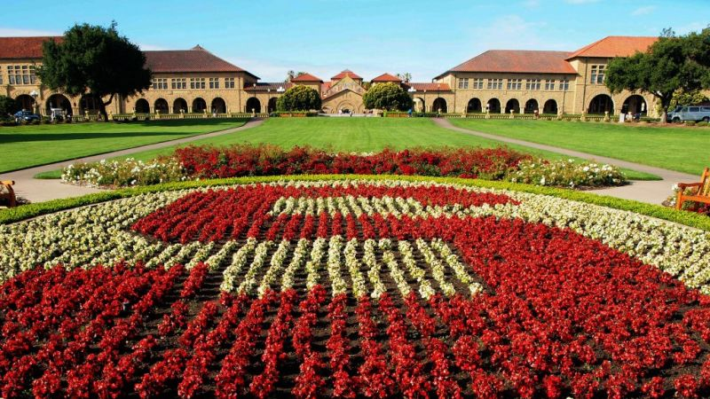

After 2ish years at the University of Oxford as a postdoc, I’m excited to share that I am joining Stanford University this week as a postdoc for the COOLER project, whose goal is to enable low-carbon, electrified district energy systems using Stanford campus as a real-life testbed.

I would like to thank Prof. [David Wallom](https://eng.ox.ac.uk/people/david-wallom/) and other group members at Oxford for truly allowing me to grow and helping me flourish in my role. It’s been a great pleasure working with them, and I am proud of what I have accomplished at Oxford during the COVID-19 pandemic.

At Stanford, I will be working with [Prof. Sally Benson](https://profiles.stanford.edu/sally-benson), [Jacques de Chalendar](https://profiles.stanford.edu/jacques-de-chalendar?tab=bio), [Prof. Ram Rajagopal](https://profiles.stanford.edu/ram-rajagopal), [Prof. Peter W. Glynn](https://profiles.stanford.edu/peter-glynn), [Prof. Adam Brandt](https://profiles.stanford.edu/adam-brandt), and [Prof. Frank Wolak](https://profiles.stanford.edu/frank-wolak) for the exciting COOLER project. Many thanks for having me. I couldn’t be more excited to start this new chapter in my career.

