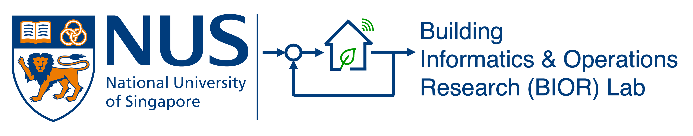

<aside class="research-sidebar">
  <a href="#overview" class="active">Research Overview</a>

  

    <a href="#research-thrusts" class="sidebar-parent">
      Research Thrusts
      ▾
    </a>
    

      <a href="#free-systems" class="sidebar-subitem">FREE energy systems</a>
      <a href="#digitalization" class="sidebar-subitem">Digitalization</a>
      <a href="#control" class="sidebar-subitem">Control</a>
      <a href="#ai" class="sidebar-subitem">AI</a>
    

  

  <a href="#research-center">Research Center</a>
  <a href="#testbeds">Living Testbeds</a>
</aside>

<main class="research-main">

<h2 id="overview" class="research-section-title">Research Overview</h2>

<code style="color: #EF7C00; font-weight: bold;">Smart</code>

<code style="color: #EF7C00; font-weight: bold;">Low-carbon</code>

<code style="color: #EF7C00; font-weight: bold;">Energy-efficient</code>

<code style="color: #EF7C00; font-weight: bold;">Demand-flexible</code>

<code style="color: #EF7C00; font-weight: bold;">Climate-resilient</code>

<code style="color: #EF7C00; font-weight: bold;">Equitable</code>

<code style="color: #003D7C">Building, District, and Urban Energy Systems.</code>

Our BIOR lab aims at developing sustainable and scalable technologies and computational tools to make building, district, and urban energy systems smart, low-carbon, energy-efficient, energy-flexible, climate-resilient, and equitable using optimization, learning, and control.

Our interdisciplinary research is at the interface of Building Science, Computer Science, and Control Engineering.

We employ a multifaceted approach that encompasses data analytics & machine learning, physics-based modeling & simulation, optimization & model-based optimal controls, as well as experiments. These approaches have been deployed across a spectrum of scales, spanning from equipment- through building- and community- to city-scale.

Specifically, our research interests include:

<ul>
<li><strong>FREE energy systems</strong>: Flexible, Resilient, Efficient, and Equitable (FREE) multi-scale building-integrated energy systems with distributed energy resources (DERs)</li>
<li><strong>Digitalization</strong>: Multi-scale digital twins (DT) and energy management information system (EMIS)</li>
<li><strong>Control</strong>: Model-based and learning-based optimal control</li>
<li><strong>AI</strong>: AI for building and urban science and engineering (AI4BUSE)</li>
</ul>

<h2 id="research-thrusts" class="research-section-title">Research Thrusts</h2>

<h3 id="free-systems" class="research-subtitle">
  
    Thrust 1: FREE energy systems
  
  
    Flexible, Resilient, Efficient, and Equitable (FREE) multi-scale building-integrated energy systems with distributed energy resources (DERs)
  
</h3>

<figure class="research-card">

<figcaption>

Complex cyber-physical district energy system

<a href="https://doi.org/10.1016/j.enbuild.2023.113339" target="_blank" rel="noopener">[Link]</a>
<a href="https://sesi.stanford.edu/energy-systems/central-energy-facility" target="_blank" rel="noopener">[Link]</a>

</figcaption>
</figure>

<figure class="research-card">

<figcaption>

Coordination and negotiation in a cyber-physical multi-entity residential microgrid

<a href="https://doi.org/10.1016/j.rser.2020.110248" target="_blank" rel="noopener">[Link]</a>

</figcaption>
</figure>

<h3 id="digitalization" class="research-subtitle">
  
    Thrust 2: Digitalization
  
  
    Multi-scale digital twins (DT) and energy management information system (EMIS)
  
</h3>

<figure class="research-card">

<figcaption>
Urban Microclimate-Informed Digital Twins
<a href="https://urbandt.org/" target="_blank" rel="noopener">[Visit]</a>
</figcaption>
</figure>

<figure class="research-card">

<figcaption>
NUS Campus EMIS
<a href="http://10.245.67.108:3000/login" target="_blank" rel="noopener">[Visit]</a>
(login required; NUS intranet only)
</figcaption>
</figure>

<figure class="research-card">

<figcaption>
Building Digital Twins
<a href="https://www.buildingdt.org/" target="_blank" rel="noopener">[Visit]</a>
(login required)
</figcaption>
</figure>

<h3 id="control" class="research-subtitle">
  
    Thrust 3: Control
  
  
    Model-based and learning-based optimal control
  
</h3>

<figure class="research-card">

<figcaption>
Schematic diagram of MPC for building energy systems
<a href="https://maomaohu.net/project/0_mpc_ac/" target="_blank" rel="noopener">[Link]</a>
<a href="https://maomaohu.net/project/1_mpc_floor/" target="_blank" rel="noopener">[Link]</a>
</figcaption>
</figure>

<h3 id="ai" class="research-subtitle">
  
    Thrust 4: AI
  
  
    AI for building and urban science and engineering (AI4BUSE)
  
</h3>

<figure class="research-card">

<figcaption>
Explainable machine learning using large-scale smart meter data
<a href="https://maomaohu.net/software/ifeel/" target="_blank" rel="noopener">[Link]</a>
<a href="https://doi.org/10.1016/j.scs.2021.103380" target="_blank" rel="noopener">[Link]</a>
<a href="https://doi.org/10.1016/j.enbuild.2023.112896" target="_blank" rel="noopener">[Link]</a>
</figcaption>
</figure>

<h2 id="research-center" class="research-section-title">Research Center</h2>

<h3 class="research-subtitle">
  Center for Digital Building Technology
</h3>

<figure class="research-card">

<iframe
src="https://www.youtube.com/embed/gY_YT0Vc8EA?si=YctpIQsh5_LxP-xr"
title="Centre for Digital Building Technology"
allow="accelerometer; autoplay; clipboard-write; encrypted-media; gyroscope; picture-in-picture; web-share"
referrerpolicy="strict-origin-when-cross-origin"
allowfullscreen>
</iframe>

<figcaption class="left-caption">
Dr. Hu has served as the deputy director of the
<a href="https://cde.nus.edu.sg/dbe/centre-for-digital-building-technology/" target="_blank" rel="noopener">Center for Digital Building Technology</a>
since 2025. The center's primary mission is to enhance quality and productivity by leveraging digital building technologies to transform how people design, deliver, and manage the built environment. These technologies include augmented reality (AR), virtual reality (VR), building information modeling (BIM), the Internet of Things (IoT), robotics and automation, video analytics, and digital twins, all supported by advanced equipment and devices.
</figcaption>
</figure>

<h2 id="testbeds" class="research-section-title">Living Testbeds</h2>

<h3 class="research-subtitle">
  SDE 4, a net-zero energy building
</h3>

<figure class="research-card">

<figcaption class="left-caption">
SDE4 is Singapore’s first new-build net-zero energy building, designed to exemplify human-centric and integrated sustainable development. Completed in 2019, the six-story structure incorporates passive design strategies, including a large overhanging roof and double facades on its east and west sides, to provide shading and minimize solar heat gain. Its hybrid cooling system enhances energy efficiency by maintaining comfortable indoor temperatures without excessive cooling. The building is powered by over 1,200 solar photovoltaic panels on its roof, generating more than 500 MWh of electricity annually to achieve a zero or positive energy balance. With a gross floor area of 8,514 square meters, SDE4 houses research laboratories, design studios, and community spaces, fostering interdisciplinary collaboration with public agencies and industry partners. Serving as a living laboratory, it plays a key role in advancing sustainable building technologies.
</figcaption>
</figure>

<h3 class="research-subtitle">
  Smart Green Home
</h3>

<figure class="research-card">

<figcaption class="left-caption">
The Smart Green Home is a cutting-edge indoor test-bed dedicated to advancing research and innovation in smart and sustainable living. This 100 m² full-size home provides a plug-and-play environment for testing smart features, green building technologies, and human-centric design solutions. Its reconfigurable structure enables flexible experimental setups, allowing researchers to study energy efficiency, indoor environmental quality, and sustainable home innovations. The facility also supports the exploration of novel materials, sensor-based control systems, and adaptive facades to enhance occupant comfort while optimizing energy performance.
</figcaption>
</figure>

<h3 class="research-subtitle">
  District cooling systems on campus
</h3>

<figure class="research-card">

<figcaption class="left-caption">
NUS operates multiple district cooling systems that efficiently cool buildings across its campus using centralized chilled water plants. This system produces and distributes chilled water through underground pipes to multiple buildings within a two-kilometer radius, eliminating the need for individual chiller plants and cooling towers. Heat exchangers optimize flow and regulate pressure, improving overall efficiency. By leveraging economies of scale and optimizing asset performance, district cooling reduces energy costs by up to 40% compared to traditional air-conditioning systems. Additionally, it lowers carbon emissions while enhancing grid reliability and climate resilience.
</figcaption>
</figure>

</main>

